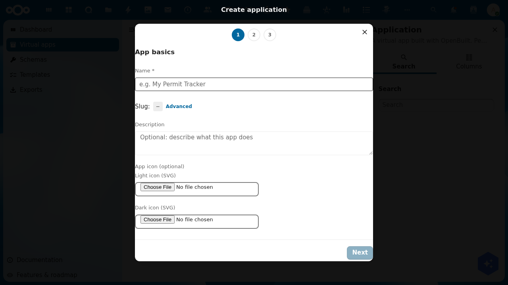
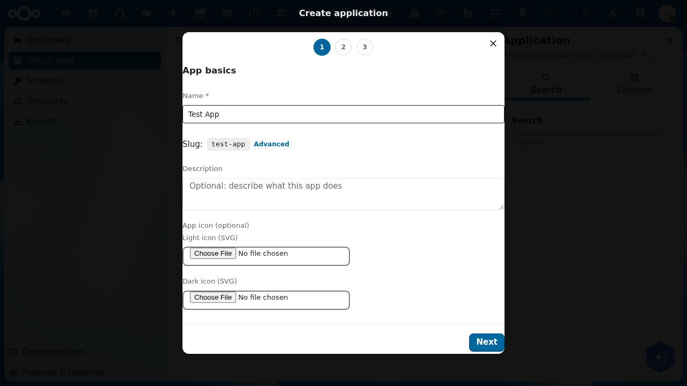
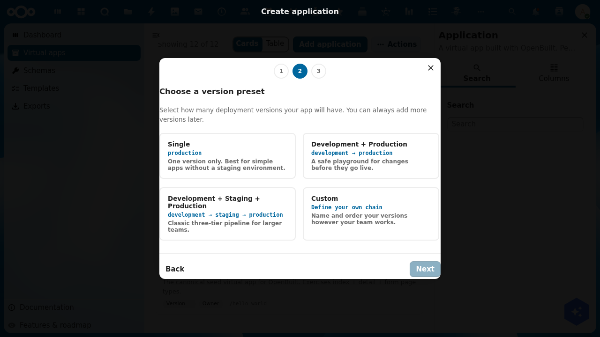
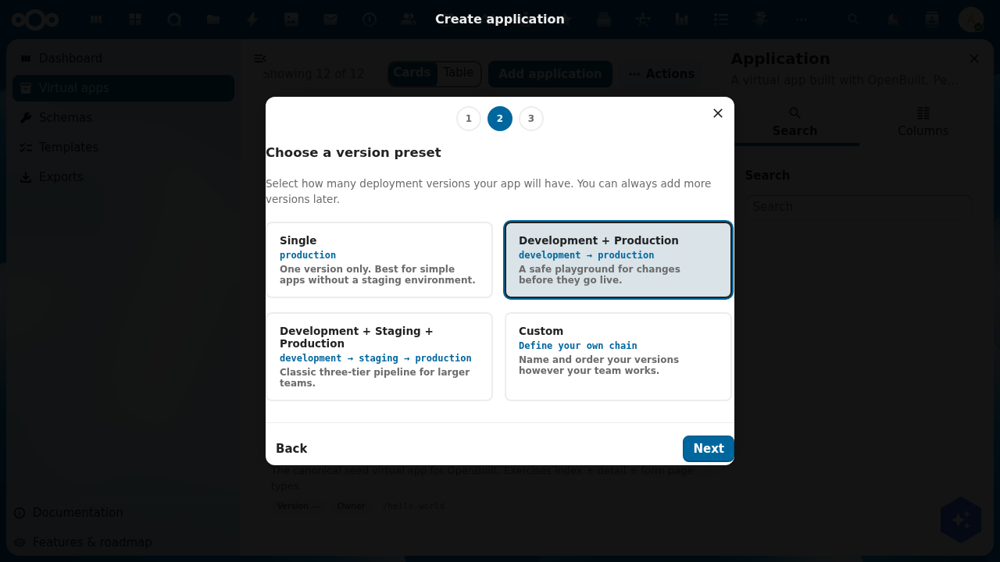
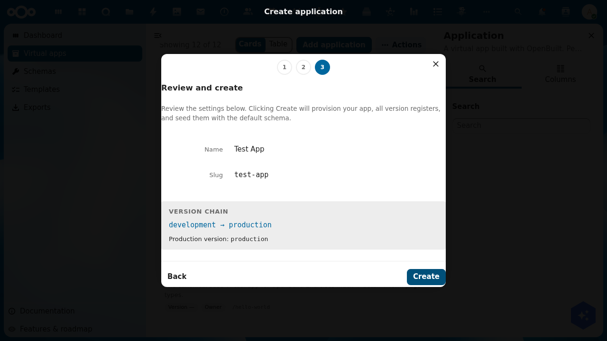
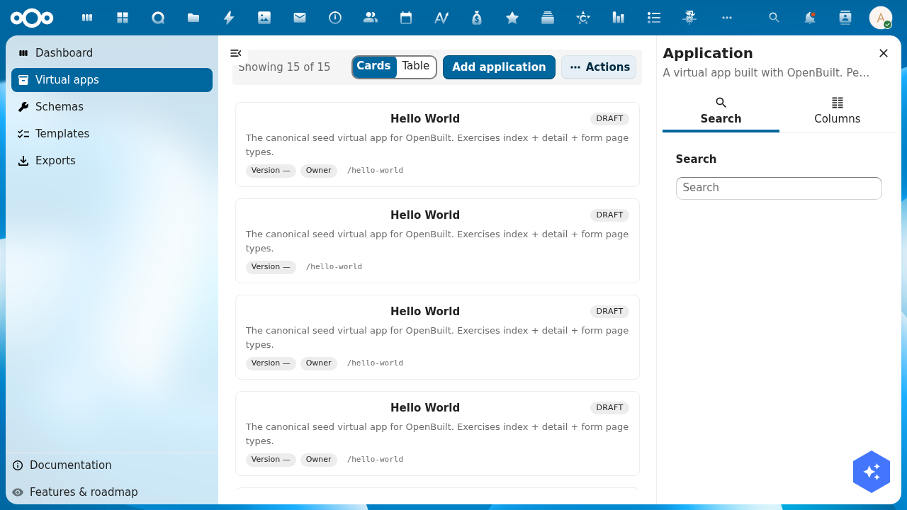

# Tutorial: Create a virtual app

> **Audience**: Buildiq admins creating their first virtual app.
> **Prereqs**: Buildiq and OpenRegister installed and enabled. Signed in as a Nextcloud admin. Creating an app is admin-only, and capped at ten creations an hour.
> **Outcome**: A new virtual app named **Test App** with a `development → production` version chain. Both versions get their own register, seeded with the default `hello-message` schema. You become the app's sole owner.

## 1. Open the wizard

Open **Apps** in the Buildiq left navigation and click **Add app** in the actions bar.

The **Create app** dialog opens on step 1, *Basics*.

The header shows three steps: **Basics**, **Preset** and **Review**. Picking the **Custom** preset later inserts a fourth, so Review becomes step 4.

## 2. Step 1, app basics

Fill in:

- **Name** (required). The display label, for example *Test App*.
- **Slug**. Derived from the name in `kebab-case` and shown under the field. Click **Advanced** to set it yourself. It must match `^(?!_)[a-z0-9][a-z0-9-]*[a-z0-9]$`. A leading underscore is reserved.
- **Description** (optional). What the app is for.
- **App icon** (optional). Pick from the **Material** or **OpenGemeenten** libraries, or choose **Upload your own SVG**. **Add a dark override** gives you a second icon for dark backgrounds.

There is also a **Generate with AI** button. It drafts the whole app from a prompt instead of the three steps below. This tutorial takes the manual path.

**Next** enables as soon as **Name** is valid.

## 3. Step 2, choose a version preset

Pick the shape of your version chain.

| Preset | Chain | Best for |
|--------|-------|----------|
| **Single** | `production` | One version only. No staging environment. |
| **Development + Production** | `development → production` | A safe playground for changes before they go live. |
| **Development + Staging + Production** | `development → staging → production` | Classic three-tier pipeline for larger teams. |
| **Custom** | Define your own chain | Name and order your versions however your team works. |

**Custom** adds a step where you type each version name. The slug derives itself, rows drag to reorder, and top to bottom is upstream to downstream.

For this tutorial, pick **Development + Production**.

## 4. Step 3, review and create

The **Review and create** screen shows what the wizard is about to provision:

- **Name** and **Slug** from step 1.
- **Version chain**, in arrow form (`development → production`).
- **Production version**: the one end users will land on.

Click **Create**. The backend then runs as one transaction:

1. Validate the whole payload.
2. Create the `Application` record. You become its sole owner.
3. Per version, in chain order: create the `ApplicationVersion` record, provision the register `openbuild-{appSlug}-{versionSlug}`, and seed the default schema set with version-namespaced slugs.
4. Point each non-terminal version's `promotesTo` at the next version downstream.
5. Set `Application.productionVersion` to the terminal version.

Any failure rolls every created object back, in reverse order. On success the dialog closes and you land on the app's detail page at `/apps/buildiq/applications/<uuid>`.

The detail page shows:

- The hero: name, description, type badge, status badge, your role badge, and the version pills. A star marks the production version.
- Four numbers over a **7d / 30d / 90d** window: **Active users**, **Object count**, **Storage** and **Audit events**. All are zero on a fresh app. Each one deep-links into OpenRegister.
- An activity graph, empty until the audit trail has something to draw.
- **Manifest layers**: the base manifest, the shared admin delta, and your own per-user delta when the app allows one.
- **Register**, naming this version's register and its schema count.
- **Groups & users**, **Pages**, **Menu**, **Schemas** and **Flows**, each with an add or manage affordance.

Go back to **Apps** and your new app is in the grid.

## 5. What you have now

- One `Application` record with your slug.
- Two `ApplicationVersion` records, `development` and `production`, chained in that order.
- Two registers: `openbuild-test-app-development` and `openbuild-test-app-production`.
- The `hello-message` schema in each, named `test-app-development-hello-message` and `test-app-production-hello-message`. Schema slugs are unique across the whole organisation, which is why they carry the prefix.

## What's next

- **Design your schemas** at `/apps/buildiq/builder/{slug}/schemas`. Add fields, states, transitions and access scopes.
- **Design your pages** at `/apps/buildiq/builder/{slug}/pages`. Lay out screens and the menu, then use **Save & open preview**.
- **Promote** when development is ready. See [Update a virtual app](./update-a-virtual-app.md).

## Troubleshooting

- **Add app does nothing, or is missing**. Creating an app is admin-only. The endpoint refuses a non-admin before the controller runs, so the button has nothing to show for it.
- **"Property 'register' should match pattern"**. A per-version register must be named `openbuild-{appSlug}-{versionSlug}`. The `openbuild-` prefix is pinned by the `applicationVersion` schema and did not move with the app rename. Do not rewrite it to `buildiq-`.
- **Schema uniqueness violation on create**. Schema slugs are unique per organisation. The wizard prefixes every seed slug with `{appSlug}-{versionSlug}-`. If you fork the seed list, keep the prefix.
- **The app appears but has no pages**. The wizard seeds schemas, not pages. Open the page designer and add the first one.
