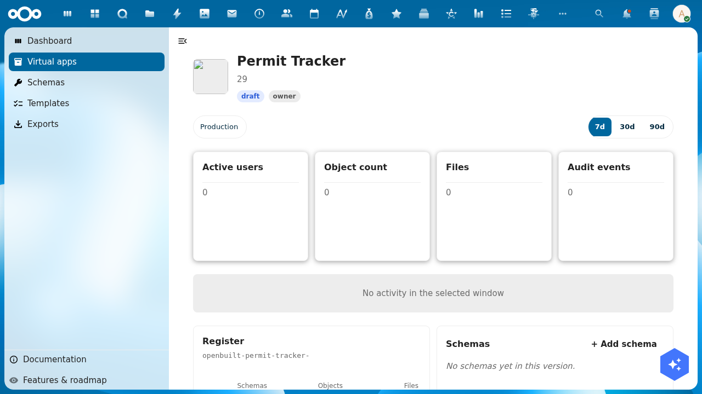
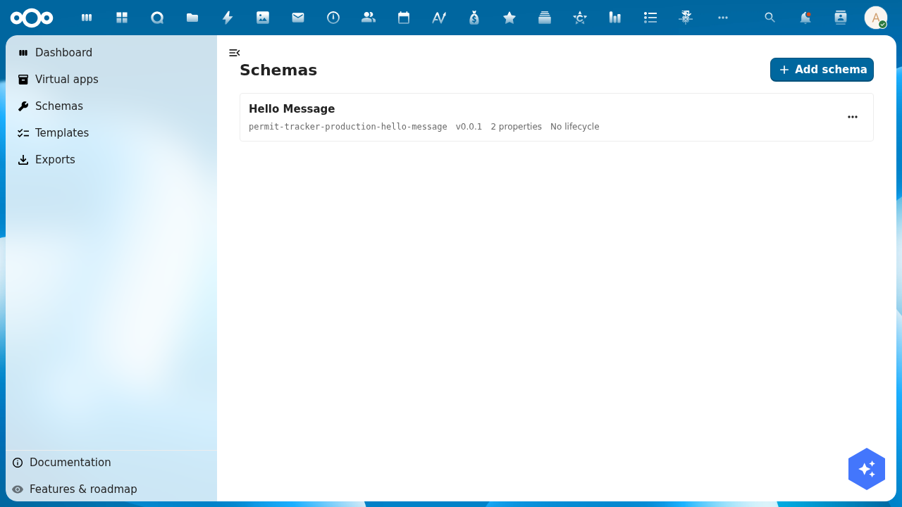
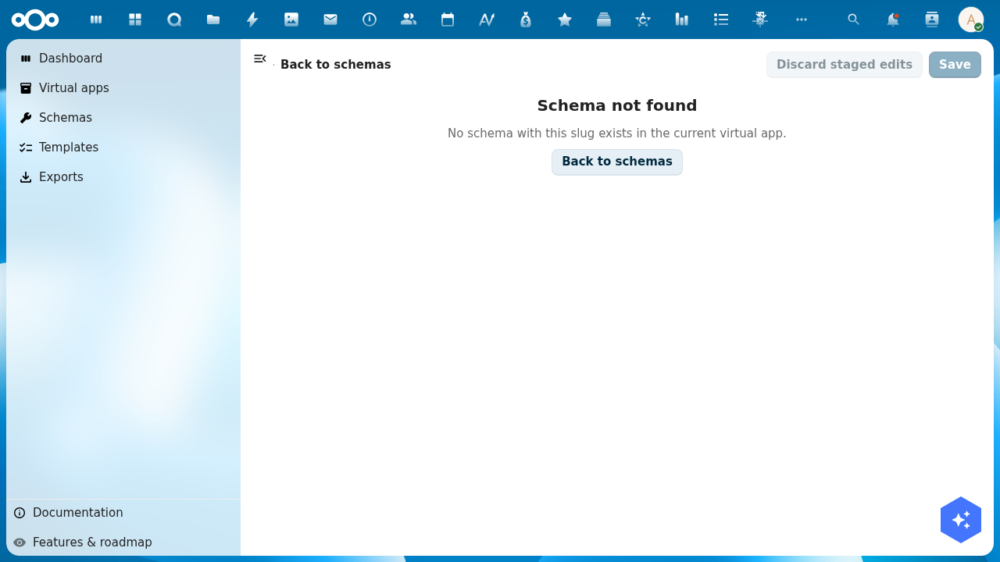

# Tutorial: Update a virtual app

> **Audience**: Buildiq admins who created an app with the wizard and now want to evolve it: design schemas, edit pages, switch versions, promote changes.
> **Prereqs**: A virtual app already exists in Buildiq, see [Create a virtual app](./create-a-virtual-app.md). The example below uses `Permit Tracker` on the `development → production` preset.
> **Status**: The whole flow works. The schema editor, which an earlier version of this page reported as broken, is fixed.

## 1. Open the app detail page

Open **Apps** in the left navigation, then click your app's card.

The detail page gives you:

- **Hero**: app name, description, type badge, status badge, your role badge and the current version.
- **Version pills**: one per version in the chain. A star marks the production version. A **›** button appears on any version that has somewhere to promote to.
- **Header actions**: **Open app**, **Open a version**, **Settings**, **Edit** and an **Actions** menu.
- **Window toggle** (7d / 30d / 90d), scoping the activity graph and the four numbers below it.
- **Four metrics** for the selected version's register: Active users, Object count, Storage and Audit events. Each deep-links into OpenRegister.
- **Widgets**: Manifest layers, Register, Groups & users, Pages, Menu, Schemas and Flows.

The metrics load a few seconds after the page, so **Loading…** on first paint is normal.

## 2. Open the schema designer for a version

The **Schemas** widget lists what is installed in the selected version and links straight into the designer. You can also type the URL:

- `/apps/buildiq/builder/{appSlug}/schemas`
- With a version: `/apps/buildiq/builder/{appSlug}/schemas?_version=development`

The `_version` parameter carries a leading underscore on purpose. A virtual app may surface its own `?version=`, and the two must not collide.

Each row shows the schema's title, slug, version, property count, lifecycle and access scope. Seed schemas the wizard provisioned are namespaced `{appSlug}-{versionSlug}-`, because schema slugs are unique across the organisation. So `hello-message` becomes `permit-tracker-production-hello-message`.

## 3. Edit a schema

Click a row. The schema editor opens at `/apps/buildiq/builder/{appSlug}/schemas/{schemaSlug}` with **Undo**, **Redo**, **Discard staged edits** and **Save** in the toolbar, and these sections:

- **Schema slug**, **Title**, **Description**, **Version (semver)**.
- **Fields**. Name, type, required, description, format, pattern, minimum and maximum length.
- **Lifecycle**. States and transitions, each action picked from a fixed list. No code.
- **Relations**. Links to other schemas.
- **Access**. Who may read, create, update and delete records of this schema. OpenRegister enforces this on every request, not only in the menu.
- **Widgets**, **Aggregations**, **Calculations** and **Notifications**. The last three are read-only for now: they list what the schema already declares.

Hiding a menu entry is not security. Scoping a schema under **Access** is.

> An earlier version of this page recorded a "Schema not found" failure on this step:
>
> 
>
> That lookup no longer fails. The editor opens on the namespaced slug. The screenshot is kept only as a record of the old behaviour.

## 4. Switch versions

Click a version pill to switch. The builder pages carry the choice in `?_version=`, so a bookmarked URL such as `/apps/buildiq/builder/permit-tracker/pages?_version=development` pins you to that tier.

**Open a version** in the header lists every version with an **Edit** entry, for owners and editors.

Viewers see the production tier. Editors and owners see every tier. Members of the Nextcloud *admin* group pass the read and write gates through an audited bypass, but that bypass is deliberately switched off for promotion and for GitHub sync. There, an explicit role is the only way in.

## 5. Promote from development to production

Click the **›** button on the development pill. The **Promote version** dialog opens, names the source and target registers, and asks what to do with the target's data:

- **Start target with source data**. Copy development's rows into production, using development's schemas. Use this when the test data is the new shape of the real data.
- **Migrate target's existing data**. Keep production's rows, apply development's schemas and any declared migration rules. Use this for a genuine upgrade where production data must survive.
- **Empty start (destructive)**. Drop production's rows, install development's schemas. You must type the app slug to confirm.

Buildiq preselects **Migrate target's existing data** when the target is the production version, and **Start target with source data** for every other target. The dialog lives in `src/dialogs/PromoteVersionDialog.vue`; the endpoint is `POST /api/applications/{appUuid}/versions/{versionUuid}/promote`.

Promote once into a throwaway app before you promote into a real one. The empty start does exactly what it says.

## 6. What works today

| Step | Status |
|------|--------|
| Open the detail page | Works. Hero, metrics and widgets all render. |
| List schemas for a version | Works, at `/builder/{slug}/schemas`. |
| Edit a schema | Works. Fields, lifecycle, relations and access scopes. |
| Design pages and menu | Works, at `/builder/{slug}/pages`, with a live preview. |
| Switch between versions | Works, through the version pills and `?_version=`. |
| Promote through the chain | Works, through the **›** button on a version pill. |

## Troubleshooting

- **Manage permissions in the Groups & users widget does nothing**. Known issue. Use **Actions → Manage permissions** in the app header.
- **The status badge and the Data panel disagree**. The hero can read `published` while the record's publication status still reads `draft`. Trust the record.
- **The four metrics stay on "Loading…"**. Give them a few seconds. They are fetched per version, after the page itself.
- **Register slug looks truncated**. The widget shortens it for display. The register is named `openbuild-{appSlug}-{versionSlug}`, and that prefix is pinned by the schema. Never rewrite it to `buildiq-`.
